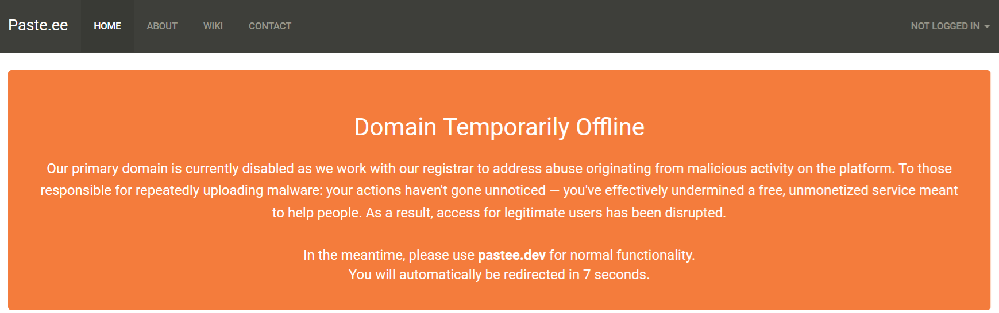

# Elaina toilet 🌸

Have you ever wanted to save something non-important quickly?  
Parsing links or images between your PC and phone?  
And you don't want to annoy your social media friends by spamming their PMs either?
Have you ever wish for a 4chan without the anons?

### → introducing **/dump/slop**

**Q: Why don't you just chat with a bot and dump things there?**  
**A:** It takes me 3 minutes to boot up Discord. Discord sucks.

**Q: Catbox?**  
**A:** No text support.

**Q: Paste.ee?**  
**A:**  

Have fun.

---

## 🌸 Features

Image board. blatant rip off of 5ch, (even the ip leak)

- **No login
- **Mobile friendly
- **🔄 literally everything is real time refresh
- **some chart i guess
- **deterministic hashed IP address into unique IP address**
- **🧹 Maid Mode:** Hidden admin mode for delete + raw data.
- 
aqua iro palette

---

## 🛠️ Technicalities

Entirely serverless — runs free on Supabase + GitHub Pages.

- **Frontend:** Vanilla HTML5 / CSS3 / JavaScript (no frameworks)
- **Backend / DB:** Supabase (PostgreSQL)
- **Storage:** Supabase Storage (S3-like)
- **Visualization:** Chart.js
- **Hosting:** GitHub Pages

---

## 🗄️ Database Schema

### **`posts`**
| Column       | Type        | Note              |
|--------------|-------------|-------------------|
| `id`         | int8        | Primary Key       |
| `created_at` | timestamptz | Default: now()    |
| `content`    | text        | Post text         |
| `image_url`  | text        | Storage link      |
| `ip`         | text        | User IP           |
| `role`       | text        | 'Maid' or 'Anonchama' |

### **`visits`**
| Column       | Type        | Note             |
|--------------|-------------|------------------|
| `id`         | int8        | Primary Key      |
| `created_at` | timestamptz | Default: now()   |
| `ip`         | text        | Visitor IP       |
| `ua`         | text        | User agent string |

---

## 🚀 Deployment

there's supabase so thats kinda annoying

